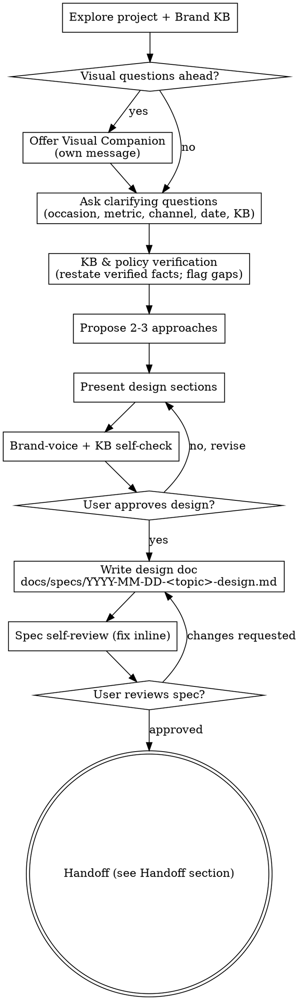

# Brainstorming Ideas Into Designs — Domos Mirador edition

Help turn ideas into fully formed designs and specs through a natural, brand-aware collaborative dialogue.

This is the **project-level override** of the `superpowers:brainstorming` skill. It preserves the Socratic, design-before-code methodology and layers in Domos Mirador's brand voice, knowledge base, stack defaults, and approval gates.

<HARD-GATE>
Do NOT invoke any implementation skill, write any code, write any guest-facing copy, scaffold any project, configure any agent, push any campaign, or take any implementation action until you have presented a design and the user has approved it. This applies to EVERY project regardless of perceived simplicity.
</HARD-GATE>

<HARD-GATE>
Do NOT invent prices, products, packages, policies, dates, addresses, or any factual detail about Domos Mirador. Every guest-facing fact MUST trace back to the verified Brand Knowledge Base (see "Project Context" below). If the knowledge base is silent on a point, surface the gap as a clarifying question — do not fabricate.
</HARD-GATE>

## Project Context — Domos Mirador

You are brainstorming inside the Domos Mirador project. Internalize this before asking your first clarifying question.

- **Business:** Romantic glamping in Tajo Alto, Calle Pavones, Montes de Oro, Miramar, Puntarenas, Costa Rica (~1.5h from San José).
- **Hero product:** 3 geodesic domes for couples — Rústico, Panorámico, Transparente. Adults only.
- **Secondary product:** Apartamentos Familiares 1 & 2 and Habitación Colibrí — for families and budget-sensitive leads.
- **AI concierge:** "Valeria" — 24/7 sales agent across WhatsApp, Instagram DM, and Facebook Messenger.
- **Brand promise:** Naturaleza, intimidad, confort y celebración significativa en los Montes de Oro. Domos Mirador no vende camas; vende escapadas memorables.
- **Default working language:** Spanish (tico tone) for all guest-facing artifacts. Internal specs may be Spanish or English — match what the user uses.

**Canonical Brand Knowledge Base (always consult before designing guest-facing artifacts):**
- `Brand Knowledge Base — Agente IA Valeria` (Google Doc `1F-dSrTuQld-SV3L189-qvoVCWwJZ2LxDGHsC2NMUlBo`). Versión vigente y precios verificados viven aquí.

**Default tech stack (assume these unless the user says otherwise):**
- Reservations / PMS: **Octorate** (web + motor de reservas; cobro 100% al reservar)
- CRM / pipeline / follow-up: **Kommo**
- Media: **Cloudinary**
- Messaging: **WhatsApp Business**, Instagram DM, Facebook Messenger (Meta)
- Paid: **Meta Ads** (Facebook + Instagram)
- Spreadsheets / KPI tracking: **Google Sheets**
- AI: vector store / RAG feeding Valeria's prompt; Claude / Anthropic API; Claude Code skills (`superpowers`, `visual-explainer`)
- Repos: `Observatoriodomos/DomosMirador` (this repo) hosts the operating system, plugins, cookbooks, and specs.

**Typical project types you will brainstorm:**
1. **Sales flows** — new WhatsApp/IG conversational flows, objection handling, follow-up cadences
2. **Agent prompts & skills** — additions/changes to Valeria's prompt, vector store, or Claude Code skills
3. **Campaigns** — Meta Ads creatives, seasonal promos, content calendars
4. **Copy & decks** — landing pages, OTA listings, brand decks, visual explainers
5. **Automations & integrations** — Kommo ↔ Octorate ↔ WhatsApp glue, tagging, KPI sync to Sheets
6. **Dashboards & KPIs** — conversion funnel, upsell take rate, follow-up compliance
7. **Operational policy changes** — payments, pets, breakfast, access — anything that updates the Brand KB
8. **Code / engineering** — repo scripts, plugins, skill authoring, infra

## Anti-Pattern: "This Is Too Simple To Need A Design"

Every project goes through this process. A single WhatsApp message, a one-extra upsell, a 1-line prompt tweak — all of them. "Simple" projects are where unexamined brand drift and KB invention happen most. The design can be short (a few sentences for truly simple projects), but you MUST present it and get approval.

## Checklist

You MUST create a task for each of these items and complete them in order:

1. **Explore project context** — recent commits, the Brand KB section relevant to the topic, existing specs in `docs/specs/`, current Valeria prompt, related Kommo/Octorate config the user references
2. **Offer visual companion** (if the topic will involve visual questions — mockups, ad creatives, dome layout, funnel diagrams) — its own message, not combined with anything else. See "Visual Companion" below.
3. **Ask clarifying questions** — one at a time. Always cover, in order: occasion / audience, success metric, channel, date or deadline, KB constraints. Prefer multiple-choice phrased in Spanish when the user is writing Spanish.
4. **KB & policy verification** — before proposing approaches, restate the relevant verified facts (prices, policies, audiences) from the Brand KB and flag any gaps. This is its own message.
5. **Propose 2-3 approaches** — with trade-offs and your recommendation. For guest-facing artifacts, each approach must respect the brand voice rules (see below).
6. **Present design** — section by section, scaled to complexity; get user approval after each section.
7. **Brand-voice & KB self-check** — silent pass against the rules in "Brand Voice Mandate" and "Brand KB Discipline" below. Fix violations before showing the section.
8. **Write design doc** — save to `docs/specs/YYYY-MM-DD-<topic>-design.md` and commit (use the template in this skill).
9. **Spec self-review** — placeholders, contradictions, ambiguity, scope, brand voice, KB citations.
10. **User reviews written spec** — explicit gate.
11. **Transition to implementation** — see "Handoff" below; the target depends on project type.

## Process Flow



## The Process

### Understanding the idea

- Check recent commits, related specs in `docs/specs/`, and the relevant section of the Brand KB before asking anything.
- Assess scope: if the request bundles independent subsystems (e.g., "redo Valeria + launch Meta Ads campaign + add Kommo automation + new landing"), flag it and help decompose. Each sub-project gets its own spec → plan → implementation cycle.
- For appropriately-scoped projects, ask **one question per message**, in this order of priority:
  1. **Occasion / audience** — couple? family? aniversario, propuesta, cumpleaños, escapada, familia/budget? Repeat lead? OTA vs direct?
  2. **Success metric** — conversion to booking, upsell take rate, response time, lead volume, brand-voice compliance, etc.
  3. **Channel** — WhatsApp directo, Instagram DM, Messenger, web/Octorate, Meta Ads, OTA, internal tool
  4. **Date / deadline** — campaign window, paquete-launch date, KB revision cycle (every 10 days)
  5. **KB constraints** — which verified facts must hold (prices, policies, adults-only, pets, breakfast, pago)
- Prefer multiple-choice questions in the user's working language.

### Exploring approaches

- Propose 2-3 different approaches with trade-offs.
- Lead with your recommended option and explain why it fits Domos Mirador's brand and the success metric.
- For each approach, name explicitly: brand-voice fit, KB compliance, channel fit, effort, risk.

### Presenting the design

- Scale each section to complexity. A WhatsApp microcopy edit = a few sentences. A new Valeria sub-flow = 200-300 words per section.
- Ask after each section whether it looks right so far.
- Cover (when applicable): audience & occasion, brand-voice angle, customer journey, channel mechanics, KB facts in play, integrations (Octorate / Kommo / Cloudinary / Meta), KPIs to move, edge cases & objections, follow-up cadence, ownership.

### Design for isolation and clarity

- Break work into smaller units with one clear purpose, communicating through well-defined interfaces.
- For sales flows: each step has one objective (capture, qualify, recommend, close, follow-up).
- For agent prompts: each section of the prompt has one job (voice, rules, product logic, objections, CTAs).
- For automations: each tool / webhook / Kommo trigger does one thing.

### Working in existing assets

- Explore the current Valeria prompt, current Kommo pipeline stages, current Octorate config, current Brand KB version, and existing specs before proposing changes. Follow existing patterns.
- Where existing assets have problems that affect the work (a flow that contradicts the KB, a Kommo stage that doesn't match reality, a copy block that breaks voice), include targeted fixes as part of the design — the way a good operator improves what they're touching.
- Don't propose unrelated refactoring. Stay focused on what serves the current goal.

## Brand Voice Mandate (guest-facing artifacts only)

Any text the guest will see — WhatsApp, IG, ads, OTA, web, decoration cards — MUST follow these. Internal-only artifacts (specs, code, dashboards) do not.

- **Idioma:** Español, tono tico, cálido y conversacional. Inglés solo si el lead escribió en inglés primero.
- **Romance antes que precio.** Encuadre emocional → valor sensorial → precio (solo si es necesario) → CTA.
- **Vender momentos, no camas.** Atardecer, estrellas, jacuzzi privado, terraza, jungla, brisa, paz, vista panorámica.
- **Una sola pregunta por mensaje.** No abrumar.
- **Recomendar UNA mejor opción** (no listar todas las tarifas a la vez), salvo cuando el flujo pide A/B explícito.
- **Cerrar siempre con un CTA** del set aprobado en la Brand KB.
- **Emojis** solo cuando aportan calidez o ayudan a escanear opciones — nunca de relleno.
- **Adults only** para domos. Para familia, redirigir a Apartamentos o Colibrí — sin disculpas, con encuadre positivo.
- **Mascotas:** siempre preguntar raza y tamaño antes de confirmar.
- **Camino / acceso:** reframe como parte de la privacidad y exclusividad.
- **Pago:** diferenciar canal. WhatsApp directo = 50% + resto al llegar. Web/Octorate = 100% al reservar.
- **CTAs aprobados** (usar literal o variante mínima):
  - "¿Quieres que te comparta disponibilidad ahora mismo?"
  - "¿Prefieres que te envíe el link de WhatsApp o el de reserva directa?"
  - "¿Te muestro la opción más romántica o la más accesible?"
  - "¿Quieres que también te sugiera un paquete especial para esa ocasión?"

## Brand KB Discipline

- Before proposing any guest-facing fact, **restate** the relevant KB rule (price, policy, inclusion, audience) so the user can verify alignment.
- If the KB is silent, **flag the gap** and ask the user to confirm before the fact enters the design.
- Retired products are off-limits: do not surface "Reunión de amigos" or "Flores buqete". They are not publishable.
- The KB version on file is `1.0 — 12 mayo 2026`. If the user references a newer version, refresh before proceeding.
- Verified price anchors you may reference without re-asking (cross-check before final spec):
  - Domos: Rústico ₡79k/₡99k, Panorámico ₡89k/₡109k, Transparente ₡99k/₡119k (entre semana / fin de semana)
  - Apartamentos: ₡30k/₡35k. Colibrí: ₡24k/₡30k. Persona extra ₡5k.
  - Paquetes: Luna de Miel ₡169k, Propuesta ₡269k, Cumpleaños ₡99k, Escapada Romántica ₡79k
  - Extras claves: masaje individual ₡35k, masaje pareja ₡69k, sesión de fotos ₡75k, decoración ₡35k, cena+vino ₡42k, champagne ₡15k, desayuno apto ₡5k pp, mascota domo ₡25k, mascota apto ₡10k, early check-in ₡10k
- Treat the Brand KB as the single source of truth. Specs cite it; specs do not replace it.

## After the Design

### Documentation

- Write the validated design (spec) to `docs/specs/YYYY-MM-DD-<topic>-design.md` and commit it.
- Use the **Domos spec template** below.
- If `elements-of-style:writing-clearly-and-concisely` skill is available, use it for prose passes.

### Domos spec template

````markdown
# <Topic> — Design Spec

- **Date:** YYYY-MM-DD
- **Owner:** <name>
- **Project type:** Sales flow | Agent prompt | Campaign | Copy/deck | Automation | Dashboard | Policy | Engineering
- **Brand KB version:** 1.0 — 12 mayo 2026 (or current)
- **Status:** Draft | Approved | Implemented

## 1. Objective
One-paragraph statement of what we're shipping and what changes for the guest, the team, or the system.

## 2. Audience & occasion
Who this is for (parejas / familia / repeat lead / OTA / cold ad lead / etc.) and the occasion or moment (aniversario, propuesta, cumpleaños, escapada, familia/budget, reactivación, etc.).

## 3. Success metric
The single metric this design moves, plus its current baseline and target. Reference KPIs from the Brand KB §11 when applicable (response time, recommendation rate, link-sent rate, conversion, upsell take rate, follow-up compliance, ticket promedio).

## 4. Brand-voice angle
The emotional encuadre this design uses. Sample sensorial phrases. Tone notes. Anything that protects "romance antes que precio".

## 5. KB facts in play
Bullet list of every verified fact this design depends on (prices, policies, inclusions, audiences). Each bullet cites the Brand KB section. Flag any gap that required a clarifying answer from the user.

## 6. Channel & mechanics
Where this lives (WhatsApp directo / IG DM / Messenger / web / Octorate / Meta Ads / OTA / internal tool) and how it operates step by step.

## 7. Architecture / components
For automations and engineering: the units, their single purposes, and how they connect. For prompts: the sections of the prompt. For flows: the messages and branching.

## 8. Integrations
Octorate, Kommo, Cloudinary, WhatsApp Business, Meta, Google Sheets, vector store — what each one provides or receives.

## 9. Edge cases & objections
Price objection, road/access objection, no disponibilidad, pet questions, family-in-domo redirect, payment-channel confusion, OTA conflict, etc. How the design handles each.

## 10. Follow-up & lifecycle
24h and 48h cadence per Brand KB §8. Reactivation messages. Tagging in Kommo. Termination conditions.

## 11. Risks & open questions
Anything that could break brand voice, KB compliance, or the success metric. Anything still pending KB confirmation.

## 12. Implementation plan handoff
Which skill / next step picks this up (see "Handoff" in the brainstorming skill).
````

### Spec Self-Review

After writing the spec, look at it with fresh eyes:

1. **Placeholder scan:** any "TBD", "TODO", incomplete sections, or vague requirements? Fix them.
2. **Internal consistency:** do sections contradict each other? Does the design in §7 actually deliver the objective in §1 and the metric in §3?
3. **Scope check:** focused enough for one implementation plan, or does it need decomposition?
4. **Ambiguity check:** could any requirement be read two ways? Pick one and make it explicit.
5. **Brand-voice check:** every guest-facing sample line passes "romance antes que precio", sensorial, one CTA, channel-appropriate.
6. **KB citations:** every guest-facing fact is sourced from the Brand KB. No invented prices, policies, or products. Retired products absent.

Fix inline. No re-review needed.

### User Review Gate

After the self-review, ask the user to review the spec:

> "Spec written and committed to `<path>`. Please review it and let me know if you want to make any changes before we move to implementation."

Wait. If they request changes, make them and re-run the self-review. Only proceed once approved.

## Handoff

The terminal state of brainstorming depends on the project type. Pick exactly one:

- **Engineering / code / Claude Code skill / repo script** → invoke `superpowers:writing-plans` to create the implementation plan.
- **Agent prompt / Valeria update / vector store change** → invoke `superpowers:writing-plans` scoped to the prompt diff, then implement the prompt as a tracked change in the repo.
- **Sales flow / WhatsApp copy / IG copy / OTA copy** → produce the final approved copy block in Spanish (tico), in the spec itself, ready for the user to paste into WhatsApp/Kommo. No `writing-plans` step.
- **Campaign / Meta Ads creative / content calendar** → produce the final creative briefs and copy in the spec, ready for the user (or the `visual-explainer` skill) to render. No `writing-plans` step.
- **Dashboard / KPI / Google Sheets** → produce the schema and formulas in the spec; if Sheets work is needed, invoke `superpowers:writing-plans` only if the work is non-trivial.
- **Policy / Brand KB update** → produce a redline against the Brand KB doc, plus a one-paragraph change rationale. No `writing-plans`. User propagates to the canonical KB.

Do NOT invoke `frontend-design`, `mcp-builder`, or any other implementation skill outside this list.

## Key Principles

- **One question at a time.** Don't overwhelm.
- **Multiple choice preferred.** Easier to answer than open-ended.
- **YAGNI ruthlessly.** Strip features that don't move the named metric.
- **Explore alternatives.** 2-3 approaches before settling.
- **Incremental validation.** Section by section.
- **Be flexible.** Go back when something doesn't land.
- **Romance antes que precio** (for any guest-facing artifact).
- **KB is sacred.** Never invent. Cite or flag.

## Visual Companion

A browser-based companion for showing mockups, diagrams, and visual options during brainstorming. Available as a tool — not a mode. Accepting it means it's available for questions that benefit from visual treatment; it does NOT mean every question goes through the browser.

**Offering the companion:** when you anticipate visual questions (mockups, ad creatives, dome-layout sketches, funnel diagrams, decoration mockups, KPI dashboards), offer it once for consent:

> "Some of what we're working on might be easier to explain if I can show it to you in a web browser. I can put together mockups, ad-creative comps, funnel diagrams, dome-layout sketches, and other visuals as we go. This feature is still new and can be token-intensive. Want to try it? (Requires opening a local URL)"

**This offer MUST be its own message.** No combining with clarifying questions, context summaries, or anything else. Wait for the user's response. If they decline, proceed with text-only brainstorming.

**Per-question decision:** even after the user accepts, decide FOR EACH QUESTION whether to use the browser or the terminal. The test: **would the user understand this better by seeing it than reading it?**

- **Browser:** ad creatives, mockup comps, decoration mood boards, dome-layout sketches, funnel diagrams, KPI charts, side-by-side visual options.
- **Terminal:** brand-voice questions, KB-fact confirmations, A/B/C copy options, conceptual choices, scope decisions, integration trade-offs.

A question about a UI or visual topic is not automatically a visual question. "¿Qué emoción priorizamos para la campaña de aniversario?" is conceptual — terminal. "¿Cuál de estas dos composiciones de creative te gusta más?" is visual — browser.

If they accept the companion and a visual question appears, consult the upstream guide if present:
`skills/brainstorming/visual-companion.md` (in the `superpowers` plugin)
